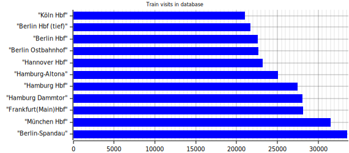

# Installation
## Abhängigkeiten
Dieses Programm ist abhängig von:
- Ein laufender [Postgresql]-Server auf `postgres://postgres@localhost/db-statistics`  
  Getestet mit Postgresql 13
- Stabile version von [Rust]
- Eine funktionierende Internetverbindung

## Schnellstartanleitung

Information: Der größte Teil dieser Anleitung funktioniert nur unter Linux. Weitere Informationen zu anderen Systemen finden Sie in der [Postgresql-Dokumentation] und auf der [Rust]-Website.

1. Zuerst müssen Sie [postgresql] installieren:
     1. Installieren Sie das Datenbankpaket auf Ihrem System:
        - Arch: `sudo pacman -S postgresql`
        - Debain & Ubuntu: `sudo apt install postgresql`
        - Sonstige: [Postgresql-Installationsanleitung](https://www.postgresql.org/docs/current/tutorial-install.html)
     2. Melden Sie sich dann bei dem neu erstellten Benutzer an: `sudo su postgres`
     3. Erstellen Sie einen neuen Datenbank-Cluster mit `initdb -D Verzeichnis/to/store/data`.
     4. Erstellen Sie im Cluster eine neue Datenbank mit dem Namen db-statistics im Cluster: `createdb db-statistics`
     5. Starten Sie den Postgresql-Server (normalerweise `sudo systemctl start postgresql`)
2. Kompilieren Sie das Projekt:
     1. Installieren Sie das Rustup-Paket:
        - Arch: `sudo pacman install rustup`
        - Debial & Ubuntu: `sudo apt install rustup`
        - Sonstige: [Rustup-Installationsanleitung](https://rustup.rs/)
     2. Führen Sie `rustup install stable` in Ihrem Terminal aus.
     3. Führen Sie `cargo build --release` im hafas-rs-Ordner aus.
        Dadurch sollte ein Ordner mit dem Namen `target/release` erstellt werden, der eine ausführbare Datei mit dem Namen `database-cli` enthält.
        Herzlichen Glückwunsch, Sie haben das Projekt gerade erfolgreich kompiliert!
3. Verwenden Sie dann `database-cli migrate`, um die Verbindung zur lokalen Datenbank zu überprüfen und die notwendige Infrastruktur wie Schemas, Tabellen und Funktionen zu erstellen.
4. Verwenden Sie `database-cli data request_raw 2000000 --parse`, um Daten anzufordern und in die Datenbank zu parsen.
     Es wird eine Weile dauern, bis alle ~1,5 Millionen Einträge abgerufen sind.
     Ich empfehle, diesen Befehl über Nacht oder zu anderen Zeiten in denen HAFAS nicht stark ausgelastet ist auszuführen.
5. Sie sind bereit, mit den Daten in Ihrer bevorzugten SQL-Eingabeaufforderung zu spielen! Weitere Informationen zur Datenbankstruktur finden Sie im [HAFAS-Abschnitt](./hafas.html).

(Optional)

6. Verwenden Sie `database-cli data parse_heatmap`, um die Eva[^eva]-Zählungen der Reise in ein leichteres Format zu parsen.
7. Verwenden Sie `database-cli create_heatmap -m 10`, um ein Diagramm der 10 am häufigsten verwendeten Stationen zu erhalten.
   
    Nachdem Sie diese Schritte ausgeführt haben, sollte das Programm ein Bild mit dem Namen `heatmap.svg` im aktuellen Ordner erstellen. Hier ist ein Beispiel dafür:
    

[Rust]: https://www.rust-lang.org/
[PostgreSQL]: https://www.postgresql.org/
[Postgresql-Dokumentation]: https://www.postgresql.org/docs/current/
[^eva]: [Internationale Bahnhofsnummer](https://de.wikipedia.org/wiki/Interne_Bahnhofsnummer)
