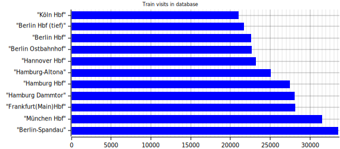

# Installation
## Dependencies
This program depends on:
- A running [Postgresql] server on `postgres://postgres@localhost/db-statistics`  
  Tested with Postgresql 13
- [Rust] stable
- A working internet connection

## Quick starter guide

Disclaimer: Most of this guide only works on Linux, you may refer to the [Postgresql documentation] and the [Rust] website for more information on other systems.

1.  Firstly, you have to install [postgresql]:
    1. Install the database package on your system:
       - Arch: `sudo pacman -S postgresql`
       - Debain & Ubuntu: `sudo apt install postgresql`
       - Other: [Postgresql install guide](https://www.postgresql.org/docs/current/tutorial-install.html)
    2. Then, login into the newly created user: `sudo su postgres`.
    3. Create a new database cluster using `initdb -D directory/to/store/data`.
    4. Start the Postgresql server (usually `sudo systemctl start postgresql`).
    5. Create a new database in the cluster named db-statistics in the cluster: `createdb db-statistics`.
2.  Compile the project:
    1. Install the rustup package:
       - Arch: `sudo pacman -S rustup`
       - Debial & Ubuntu: `sudo apt install rustup`
       - Other: [Rustup install guide](https://rustup.rs/)
    2. Run `rustup install stable` in your terminal.
    3. Run `cargo build --release` in the hafas-rs folder.
       This should create a folder named `target/release` that contains an executable named `database-cli`.
       Congratulations, you just successfully compiled the project!
3.  Then use `database-cli migrate` to check the connection to the local database and create neccessary infrastructure like schemas, tables and functions.
4.  Use `database-cli data request_raw --parse` To request data and parse it into the database. 
    This will take a while for all ~1.5 Million entries to be fetched.
    I recommend running this command over night and at other times the system is not under heavy load.
5.  You are ready to play with the data in your favourite SQL prompt! See the [HAFAS Section](./hafas.html) for more information on the database structure.

(Optional)

6. Use `database-cli data parse_heatmap` to parse trip's eva counts into a lighter format.
7. Use `database-cli create_heatmap -m 10` to get a diagram of the 10 most used stations.
   
   After following these steps, the program should create an image named `heatmap.svg` in the current folder. Here is an example for it:
   

[Rust]: https://www.rust-lang.org/
[Postgresql]: https://www.postgresql.org/
[Postgresql documentation]: https://www.postgresql.org/docs/current/

