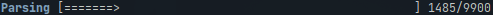

# Usage
As the name of the crate already suggests, `database-cli` compiles into a command line interface.
This interface works together with a postgresql database to store and request HAFAS data.

## List of sub-commands:
All commands can be passed -v or -vv to make them more verbose.
You can add the `--help` argument to any subcommand to see details about the arguments.
If you do not want to compile the cli, refer to the source code for arguments.

<details>
<summary>Responsible code in `main.rs`</summary>

```rust,ignore
{{#include ../../database-cli/src/main.rs:42:84}}
```
</details>

- `data` This command can only be used together with one of it's subcommand, it does not have any properties to it's own.
  It generally collects commands that are used to move lookup data for train trips on the database.

  - `request_raw`: This command requests raw schedule data over all jids in the HAFAS endpoint. 
    Independenty of the `TO` argument, the command will panic if it reaches the last jid.
    The ususal last jid is around 1.5 Million.

    This is usually the second command ran after `migrate`.

    Be aware that, depending on your computer and network connection, this command usually takes quite a long time to finish.
    It is recommended, altrough not neccessary, to invoke it with `--parse`.
    
    It is recommended to leave all other optional flags to a default value to prevent a timeout.

  - `parse`: This command parses the data from the `raw_data` table to a usable format and insertis it into the other tables. 
    It can also be called automatically by adding `--parse` to the arguments of `request_raw`.

    You may look at the database scheme and mainly the [hafas section](./hafas.html) for more details about how data gets parsed.

  - `parse_heatmap`: This command is a command that should be called at some time before using the `create_heatmap` feature. 
    It counts together all of the recorded train trips into their own table for faster access.
    
    As near and local trafic can obfuscate the ending image, I recommend setting `-o 'ICE'` as filter.

  - `check`: This command checks if data from the HAFAS endpoint differs from the current data. 
    This check is only done for a single jid. A difference might hint at a schedule change.

- `create_heatmap` Creates a horizontal bar diagram of the most used stations in the lookup table. 
  It can be filtered by cat_code, cat_out and search limit. For currently unkown reasons, anything over 11 Bars will mess up the station names.

- `migrate`: Creates all neccessary infrastructure on the remote database. The cli itself currently only operates on the lookup_data schema, but this `sqlx` feature needs 

Most of the commands will result in a progress bar like this:
<br>
The counts at the end should give you a rough hint on how long the command will take.
